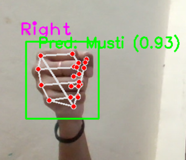
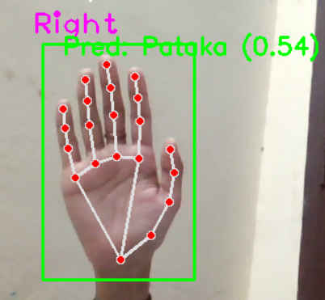
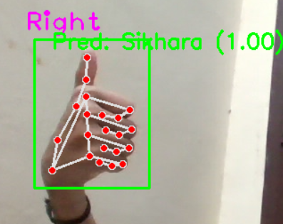
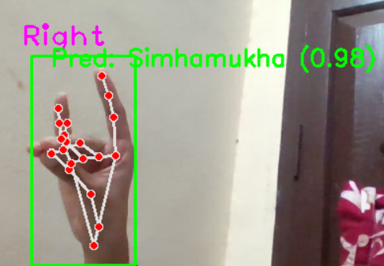
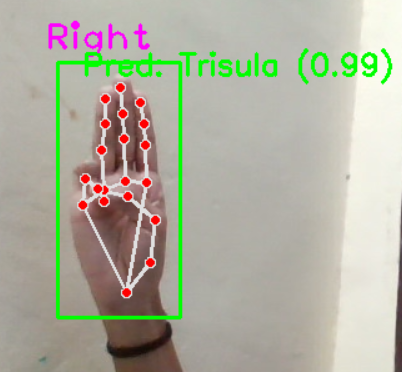

# MudraGyan 

## Real-Time Bharatanatyam Mudra Recognition System

MudraGyan is a real-time Bharatanatyam mudra recognition system that uses **Computer Vision and Deep Learning** to detect and recognize hand gestures through a webcam.

The current system recognizes five Bharatanatyam mudras: **Pataka, Musti, Sikhara, Simhamukha, and Trisula**.

---

## 🛠️ Tech Stack

---

## 📂 Files

| File | Description |
|------|-------------|
| `hand_detection.py` | Captures and saves hand images using the webcam |
| `data_augmentation.py` | Augments the dataset with additional images |
| `new_cnn.py` | Trains the CNN model and generates the trained model |
| `test.py` | Tests the trained model on input images |
| `evaluation.py` | Evaluates the model using the test dataset |
| `realtime_test.py` | Performs real-time mudra recognition using the webcam |

---

## Output

